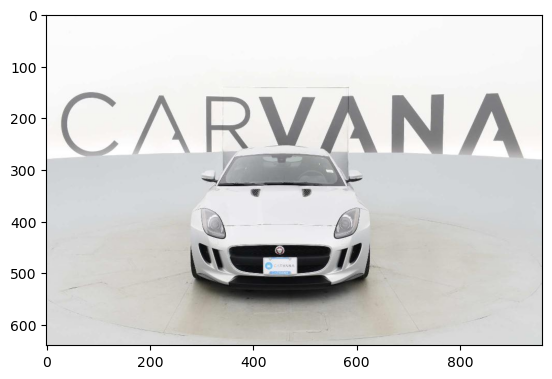
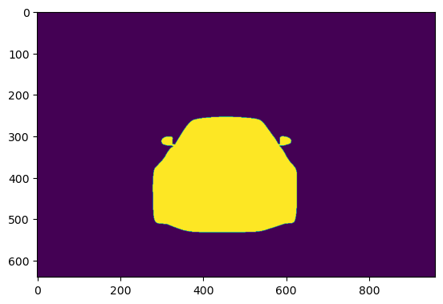

# Carvana U-Net

U-net implementation for the
[Carvana image masking challenge](https://www.kaggle.com/c/carvana-image-masking-challenge).

The model was trained on a downscaled version of the data (1/2 the width and
height of the original image.) The model weights in `./checkpoints` is based on
that downscaled version, so if you are using a pretrained model from
`./checkpoints`, they will only work on the downscaled images.

A script is available for you to downscale the data for yourself if desired.

## Model

A U-Net was used to predict the masks for the image.

A Double Convolution is defined to be:
```
Double Convolution(Input channels, Output channels) = 
Conv2d -> InstanceNorm2d -> LeakyReLU
-> Conv2d -> InstanceNorm2d -> LeakyReLU
```
The dimensions are not changed in a Doubled Convolution.

A Transposed Convolution is a stride 2 ConvTranspose2d which exactly doubles the dimensions of its
inputs.

---

A simplified definition of the model is as shown here:
```
RGB Image
-> conv_1 = Double Convolution(3, 64) -> MaxPool2d(2)
-> conv_2 = Double Convolution(64, 96) -> MaxPool2d(2)
-> conv_3 = Double Convolution(96, 128) -> MaxPool2d(2)
-> conv_4 = Double Convolution(128, 160) -> MaxPool2d(2)
-> Double Convolution(160, 192)

-> Transposed Convolution(192, 160)
-> Cat(prev, conv_4) -> Double Convolution(320, 160)
-> Transposed Convolution(160, 128)
-> Cat(prev, conv_3) -> Double Convolution(256, 128)
-> Transposed Convolution(128, 96)
-> Cat(prev, conv_2) -> Double Convolution(192, 96)
-> Transposed Convolution(96, 64)
-> Cat(prev, conv_2) -> Double Convolution(128, 64)

-> Double Convolution(64, 3)
```

The model is rather underpowered (normally with U-nets, the number of channels
double in size after every Double Convolution. So 64 -> 128 -> 256 -> 1024. In
this case, the number of channels only increases by 32.) This is because a
more powerful model would not be able to fit on my GPU.

## Sample Prediction

The model was trained from scratch on a Nvidia Tesla P100 GPU for approximately
2 hours for 10 epochs. The training set consisted of 3680 images and their masks.

Note: The provided training images were split into 2 sets, a training set and a
validation set. The training set consisted of all training images with "ids" not
ending with the numbers 1, 2, 3, or 4.
```python
self.image_ids = []
for file_name in listdir(image_directory):
    if path.isfile(path.join(image_directory, file_name)) and not file_name.startswith("."):
        if train != file_name.split("_")[0].endswith(("1", "2", "3", "4")): # XOR
            self.image_ids.append(file_name.split(".")[0])
```

---

Given input image:



The model predicted:


The expected output is:



The accuracy for this particular image was reported to be 99.7% in terms of how
many pixels are the exact same across both images.

The performance is pretty good given the fact that it was only trained for 10
epochs with an underpowered model. To improve predictions, train for some more
epochs and/or with a more powerful model (increase the number of channels after
every Double Convolution).

## Running

Optional: Create an environment using the provided `environment.yml` file:
```
conda env create -n chosen_name -f environment.yml
```

1. Get the dataset from [Kaggle](https://www.kaggle.com/c/carvana-image-masking-challenge)
2. Optional: Resize the images using `resize.py`. This is necessary if you want
to use the pretrained models from `checkpoints/`, or if you want to train only
on half dimension images for less RAM usage.
3. Edit the paths to the images in `unet.ipynb`.
4. Run the necessary cells in `unet.ipynb`. If you are not training, you should
run all cells except for the last two.

## License

All images belong to their respective owners, in this case Carvana. The images
were included here for free, educational, and demonstrational purposes only.

The model weights in `checkpoints/` are trained from scratch, and can be freely
used by anyone for any purposes.

## Learn More

[Pytorch Tutorial](https://pytorch.org/tutorials/)

[Carvana Image Masking Challenge](https://www.kaggle.com/c/carvana-image-masking-challenge)

[U-Net: Convolutional Networks for Biomedical Image Segmentation](https://arxiv.org/abs/1505.04597)
